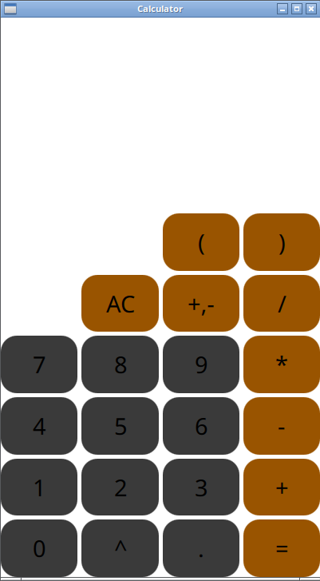
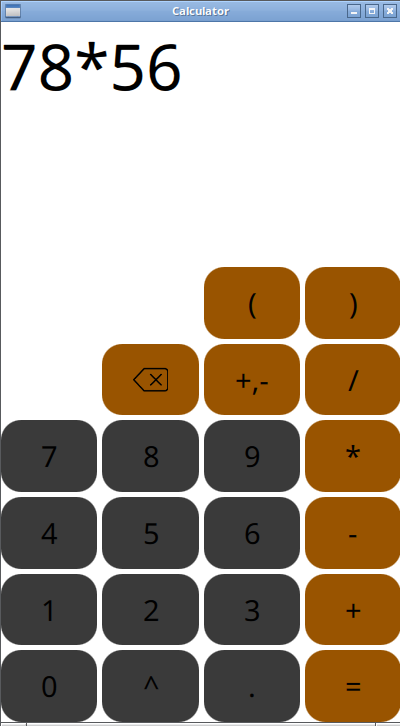
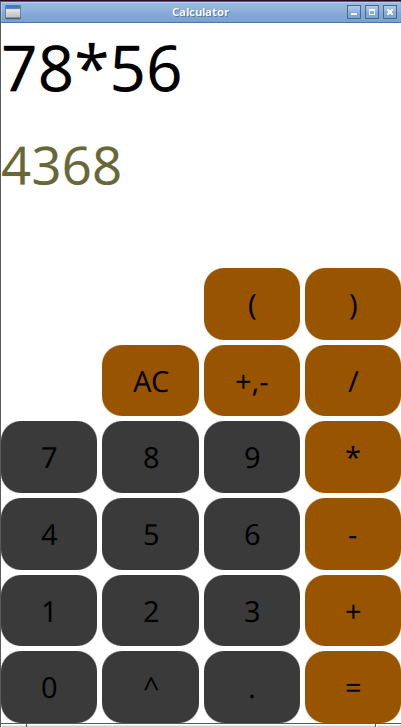

## Calculator

## 📜 Description

This is a standard calculator written in C++.
It supports the following operations: + - / *  ^.
It does not support functions.
The parser is written with coroutine C++ 20.

## 🖼 UI







## 📝 Technologies

- _CMake_
- _Qt_
- _Qml_
- _C++_

## 💻 Supported systems

- [ ] _Windows_ (may be)
- [ ] _MacOS_ (may be)
- [X] _Linux_

## ⚙️ Build

_Cloning repository and dependencies_

You should have Qt6 pre-installed.

```shell
git clone git@github.com:b1tflyyyy/calculator-cxx.git
git submodule update --init --recursive
```

_Final build_
```shell
cmake -G Ninja -DCMAKE_C_COMPILER=clang-19 -DCMAKE_CXX_COMPILER=clang++-19 -DCMAKE_BUILD_TYPE=Debug ..
ninja 
```